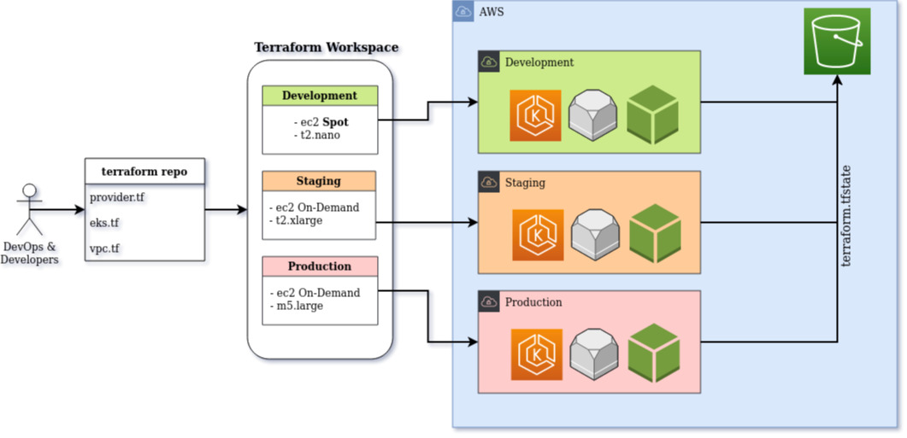
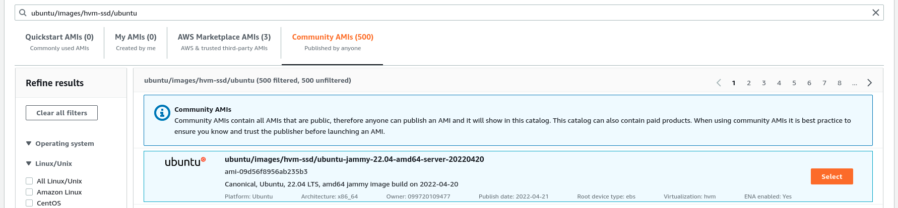
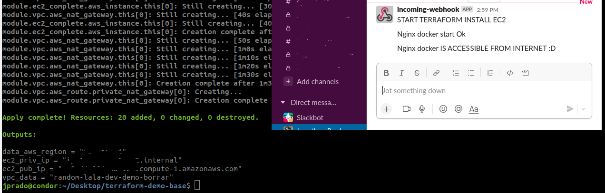

# Infrastructure stack for DevOps and SRE

### Prerequisites

|name         | version | url   | obs      |
| ---         | ---     |   --- |  ---     |
| linux(apt)  |    -    |   -   | curl jq  |
| aws-cli     | v2.0.x  |https://docs.aws.amazon.com/cli/latest/userguide/getting-started-install.html | - |
| aws-iam-authenticator   | v0.5.0  |https://docs.aws.amazon.com/eks/latest/userguide/install-aws-iam-authenticator.html | - |
| eksctl      | v0.91.x |https://docs.aws.amazon.com/eks/latest/userguide/eksctl.html | Optional |
| helm        | v3.7.x  |https://helm.sh/docs/intro/install/ | - |
| kubectl     |client(1.22)  server(1.19) | https://kubernetes.io/docs/tasks/tools/install-kubectl-linux/ | - |
| terraform   | v1.1.9  |https://learn.hashicorp.com/tutorials/terraform/install-cli | - |

 

### Create your aws config file
	cp -p /home/$(whoami)/.aws/config /home/$(whoami)/.aws/config_original
	#	
	echo -e "[profile MyProfile] \
		\n role_arn=ZZZZZZZZZZZZZZZZZZZZZZZZZZ \
		\n source_profile=default \
		\n region=MY-REGION" > /home/$(whoami)/.aws/config
	#	
	cp -p /home/$(whoami)/.aws/credentials /home/$(whoami)/.aws/credentials_original 	
	echo -e "[default] \
		\n aws_access_key_id=AAAAAAAAAAA \
		\n aws_secret_access_key=BBBBBBBBBBB \
		\n region=MY-REGION" > /home/$(whoami)/.aws/credentials

### Clone and prepare environment. 
	git clone git@repo.git
	cd infra-stack

### Configure profile and destination deploy (terraform.tfvars)
	Go to terraform.tfvars and update "aws_profile" need to be same to .aws/config  --->  [profile your-profile-name]

### Create a S3 bucket
	aws s3api create-bucket --acl private --bucket MY-BUCKET-NAME  --region MY-REGION  --profile YOUR-AWS-PROFILE
	Update file config.s3.tfbackend with bucket name, region and aws-profile

### bucket Versioning
	aws s3api put-bucket-versioning --bucket MY-BUCKET-NAME --versioning-configuration MFADelete=Disabled,Status=Enabled --profile YOUR-AWS-PROFILE

### State Storage Configuration (config.s3.tfbackend)
	Go to config.s3.tfbackend and update the bucket name, and profile.
	profile: It must be same to was used in terraform.tfvars
	bucket:  It must be the same one that you created in the previous point

### Create a KeyPair to use in Terraform proviosioning.
	cd terraform/
	ssh-keygen -f ./terraform-ec2-kp -t rsa -b 4096
	Copy terraform-ec2-kp.pub to terraform.tfvars (ec2-ssh-public-key = ....)

### Standarize data and run terraform. 
	terraform init -backend-config=../config.s3.tfbackend
	terraform workspace new prod 			# Optional
	terraform workspace new dev  			# Optional
	terraform workspace select default  	# Optional
	terraform fmt -check=true -diff=true 	# Optional
	terraform fmt 
	terraform validate
	terraform plan -var-file=../terraform.tfvars
	terraform apply -var-file=../terraform.tfvars -auto-approve

### Kubeconfig
	cp -p /home/$(whoami)/.kube/config /home/$(whoami)/.kube/config_original
	aws --profile PROFILE  eks --region $(terraform output -raw data_aws_region) update-kubeconfig --name $(terraform output -raw eks_cluster_name)

   

### Architecture and design

working with worspaces

 

### aws AMI Selection 

ec2-base.tf  (data "aws_ami" "aws_ami_type")

 

### Provisioning instances and Slack messages

provisioning/user_data.sh

 

### Info
Asumiendo que queremos trabajar siempre con el mismo codigo de terraform, para tener nuestros entornos estandarizados y homogeneos, se deberia usar terraform workspace.
La idea de esto es que para ambientes productivos utilicemos lo que está configurado para dicho entorno, pero para ambientes de Desarrollo, QA y/o Test utilicemos la misma infraestructura pero con recursos menos costosos. 
Ej: instancias mas pequeñas e instancias SPOT en el cluster. 

Finalmente el objetivo seria automatizar el pipeline para que un developer
pueda correr el pipeline y seleccionar que desea deployar si dev o prod. 
